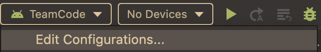
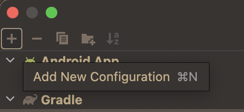
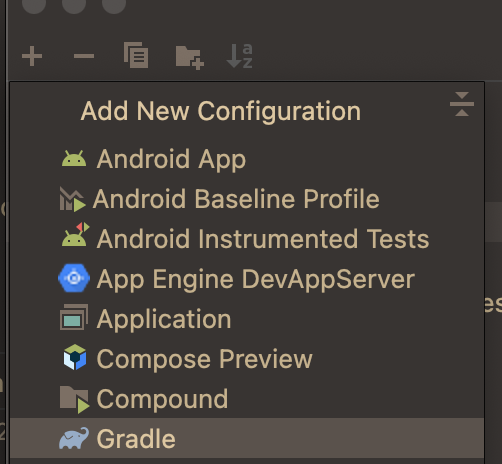
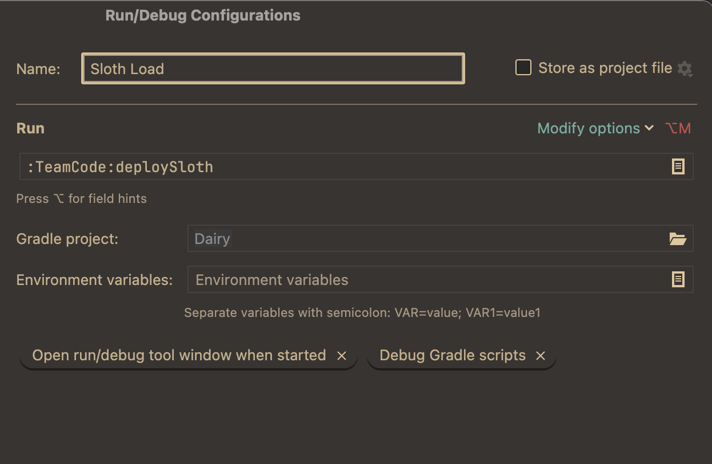
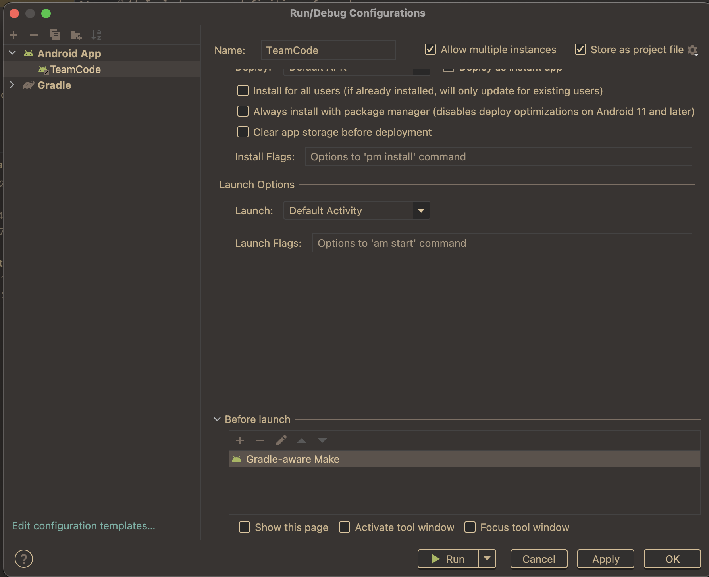
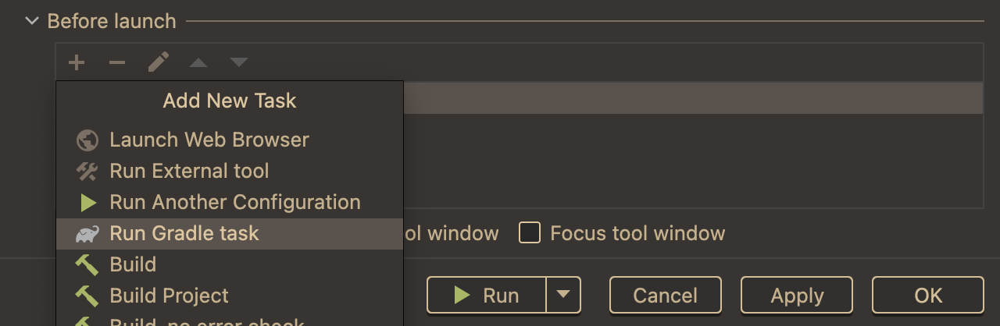
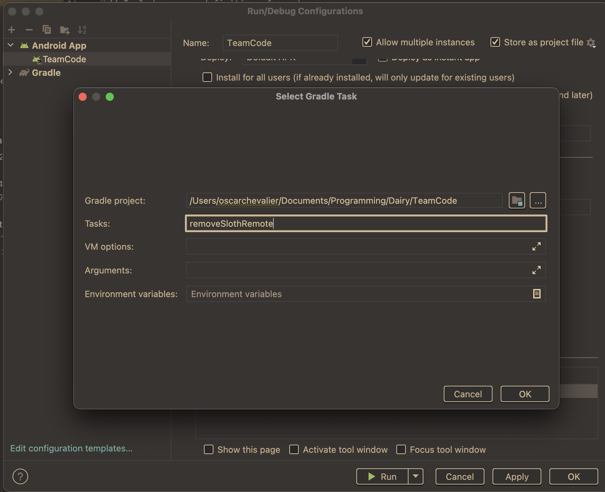
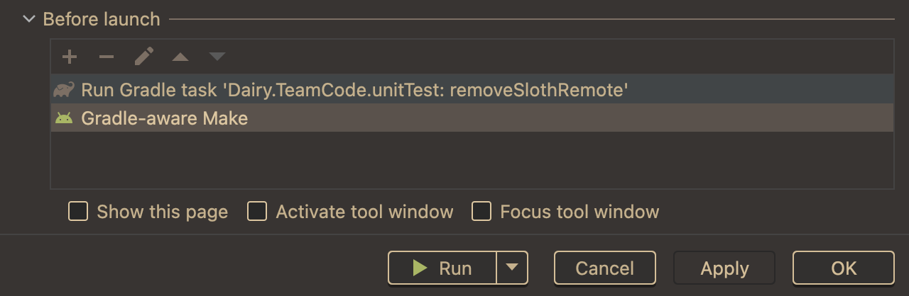

<a href="https://repo.dairy.foundation/#/releases/dev/frozenmilk/sinister/Sloth" target="_blank">

</a>

Sloth is a Sinister runtime that enables the use of Sinister's classpath scanning and dynamic 
loading capabilities on the android FTC platform.

Like fastload, Sloth is built for hot reloading your teamcode, which allows for very fast iteration of code.

Sloth has some major improvements over fastload:
1. Sloth is much faster than fastload. fastload advertises ~7 seconds upload time, Sloth should be 2 seconds or less.
2. Sloth will keep changes across restarts and power cycles of the robot.
3. `@Pinned` can be put on classes to prevent dynamically changing it, or any subclasses of it.
4. Sloth is built on a more capable runtime, that supports Dairy, and has shims for all of the SDK, meaning that all SDK classpath scanning is performed dynamically.
   - This includes device drivers, like the GoBilda PinPoint that are uploaded alongside a team's code.
5. Sloth has a drop-in replacement of Dashboard that replaces some internal mechanisms of Dashboard to use Sloth and Sinister equivalents. 
   This fork fully supports dynamic uploading for Configuration and OpModes.
6. Not hacked onto the OnBotJava system, so doesn't break that
7. Sloth only processes the change in code when your OpMode ends, which means its safe to run Sloth while running other code

There are some precautions to take when using Sloth:
1. Sloth will only dynamically hot reload classes in the `org.firsinspires.ftc.teamcode` package, and subpackages.
2. It is possible to upload code that compiles, but does not work when hot reloaded due to:
   - Installing or changing libraries.
   - Changing files that are not hot reloaded.
   - Changing `@Pinned` on files.
   Be careful to ensure that you make changes that will be changed, and if make changes that will not, 
   that you perform a full install in order to propagate them.

NOTE: If the first time you install Sloth something goes wrong, try a second full install, there is a 
chance that the first install did not have the files on the hub setup correctly.

# Installation

NOTE: if you are using Dairy, skip to the Dairy Core Heading

NOTE: if you are using Dashboard, check out the Dashboard heading.
## Sloth Library
add the dairy releases repository to your `TeamCode` `build.gradle`, above the `dependencies` block
```groovy
repositories {
    maven {
        url = "https://repo.dairy.foundation/releases"
    }
}
```

then add sloth to the `dependencies` block:
```groovy
dependencies {
    implementation("dev.frozenmilk.sinister:Sloth:0.1.0")
}
```

now install the Load Plugin

## Dairy Core
to use this release of Sloth with Dairy you need to install a snapshot version of Dairy's Core

add the dairy releases and snapshots repository to your `TeamCode` `build.gradle`, above the `dependencies` block
```groovy
repositories {
    maven {
        url = "https://repo.dairy.foundation/releases"
    }
    maven {
        url = "https://repo.dairy.foundation/snapshots"
    }
}
```

then add core to the `dependencies` block:
```groovy
dependencies {
    implementation("dev.frozenmilk.dairy:Core:2.1.0")
}
```

NOTE: you do not need to install Sloth as well, and if you currently have any installations of either
`"dev.frozenmilk.dairy:Util"` or `"dev.frozenmilk:Sinister"` then you need to remove those, this Core
version will provide the correct versions of these libraries.

now install the Load Plugin

## Load Plugin
add this to the top of your `TeamCode` `build.gradle`
```groovy
buildscript {
    repositories {
        mavenCentral()
        maven {
            url "https://repo.dairy.foundation/releases"
        }
    }
    dependencies {
        classpath "dev.frozenmilk:Load:0.1.0"
    }
}
```

add this after the apply lines in the same file
```groovy
// there should be 2 or 3 more lines that start with apply here
apply plugin: 'dev.frozenmilk.sinister.sloth.load'
```

sync and download onto your robot via standard install

now add the gradle tasks

NOTE: if you use dashboard, install that now, then setup the gradle tasks

## Dashboard
add the dairy releases repository to your `TeamCode` `build.gradle`, above the `dependencies` block (if you already have it, no need to do so again)
```groovy
repositories {
    maven {
        url = "https://repo.dairy.foundation/releases"
    }
}
```

then add dashboard to the `dependencies` block:
```groovy
dependencies {
    implementation("com.acmerobotics.slothboard:dashboard:0.1.1+0.4.16")
}
```

NOTE: if you use a library that imports dashboard via a `implementation` or `api` dependency:

ask the library maintainers to consider changing it to `compileOnly`

change the `implementation` like so:
```groovy
implementation("com.pedropathing:pedro:1.0.8") {
   exclude group: "com.acmerobotics.dashboard"
}
```
note that pedro requires this.

## Gradle Tasks

edit configurations:



add new configuration:



select gradle:



add `deploySloth` and save it:


NOTE: android studio will not auto complete the names of these tasks, just write it and it will work.

edit TeamCode configuration:



add new gradle task:



add `removeSlothRemote`:



note: type `:TeamCode` into the `Gradle Project` box to get the right contents,
do not copy mine.

put `removeSlothRemote` first and save:



Run the deploySloth task you just added to deploy the code.